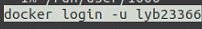
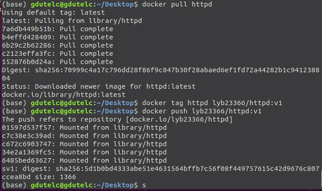
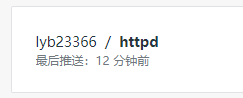
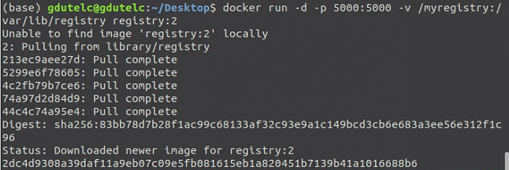

### 公共 Registry

Docker Hub和quay.io 是两个常用的公共 Registry

怎么用(以Docker Hub为例)

1. 首先得在 Docker Hub 上注册一个账号。
2. 在 Docker Host 上登录。

如上图:用户名为 lyb23366(自己账号)登录Dockers Host

`docker login -u username `再输入密码即可登录账号(记得提前注册好)

如上图,用`docker tag`修改镜像repository

3. 使用tag命令修改镜像的 repository 使之与 Docker Hub 账号匹配。
   Docker Hub 为了区分不同用户的同名镜像，**镜像的 registry 中要包含用户名**，完整格式为：[username]/xxx:tag

Docker **官方镜像没有用户名**，比如 httpd

4. 通过 docker push 将镜像上传到 Docker Hub。

docker上传镜像时,会参考已有的镜像层,从而减少上传量,甚至如果想上传同一 repository 中所有镜像,只需省略tag部分,如
`docker push cloudman6/httpd`	,即可上传

https://hub.docker.com的Public Repository 中就可以看到上传的镜像。

上传后的镜像能被其他host pull下来并运行

如图所示,该镜像已被上传至docker hub

### 本地 Registry

免费的私人Registry在docker hub上不是免费的,而且出于安全性考虑,我们需要本地Registry

1. 启动 registry 容器。

`docker run -d -p 5000:5000 -v /myregistry:/var/lib/registry registry:2`

解析:

使用镜像registry:2。

`-d` 是**后台启动容器**。

`-p` **将容器的 5000 端口映射到 Host 的 5000 端口**。5000 是 registry 服务端口。端口映射我们会在容器网络章节详细讨论。

`-v` 将**容器 /var/lib/registry 目录映射到 Host 的 /myregistry**，用于**存放镜像数据**。`-v` 的使用我们会在容器存储章节详细讨论。

2. 用`docker tag`重命名镜像,使之与registry 匹配
   `docker tag lyb23366/httpd:v1 registry.example.net:5000/lyb23366/httpd:v1`

镜像名称由 repository 和 tag 两部分组成。而 **repository 的完整格式为：[registry-host]:[port]/[username]/xxx**,
且只有 **Docker Hub 上的镜像可以省略 [registry-host]:[port]** 。

这里出了点意外,镜像push不上本地registry,所以后面的push和pull就摆了

3. 通过 `docker push` 上传镜像。
   

4. 现在已经可通过 `docker pull` 从本地 registry 下载镜像了。
   

此法下载的镜像除了名字以外与之前的并无不同