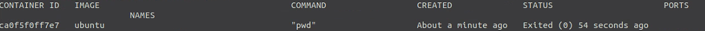
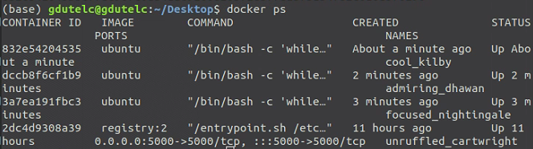
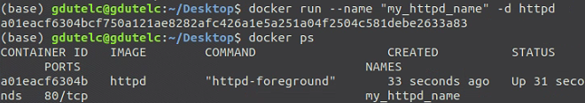

可用三种方式指定容器启动时执行的命令：

1. CMD 指令。

2. ENDPOINT 指令。

3. 在 `docker run` 命令行中指定。

   如 `docker run ubuntu pwd` 是容器启动时执行`pwd`,返回容器当前目录

执行 `docker ps` 或 `docker container ls` 可以查看 Docker host 中当前运行的容器：

但是直接使用run启动的容器指挥运行一次就退出,使用`docker ps -a`查看状态为exit

因为容器的生命周期依赖于启动时执行的命令，只要该命令不结束，容器也就不会退出。

如图,执行一次就会退出进入exit

而使用如下命令,不断运行容器,再使用-d参数后台运行容器

`docker run -d ubuntu /bin/bash -c "while true;do sleep1;done`

下面是运行以后的容器列表

`CONTAINER ID`和 `NAMES`都可以**用于指定被操作的容器**,
`NAMES`在启动容器时可以通过 `--name` 参数显示地为容器命名
比如`docker stop 832e5`和`docker stop cool_kilby`是一样的

通过 --name ""参数启动容器后,容器会被命名(只能英文和_,不能用空格)