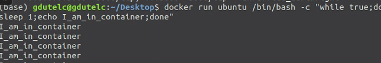
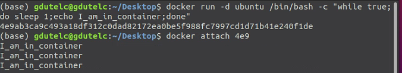
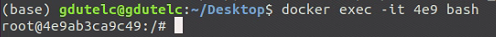

*echo*:命令的输出内容如果没有特殊含义,则原内容*输出*到屏幕;如果输出内容有特殊含义,则输出打印其含义

直接运行会输出`I_am_in_container`
附加-d参数后会在后台运行,此时使用`docker attach` 可以 attach 到容器启动命令的终端

通过 `docker exec` 进入相同的容器：

1. `-it` 以交互模式打开 pseudo-TTY，执行 bash，其结果就是**打开了一个 容器内的bash 终端。**
2. 进入到容器中，容器的 hostname 就是其 “短ID”。
3. 可以像在普通 Linux 中一样执行命令。`ps -elf` 显示了容器启动进程`while` 以及当前的 `bash` 进程。
4.  执行 `exit` 退出容器，回到 docker host。

#### 区别

1. attach 直接进入容器 **启动命令** 的终端，不会启动新的进程。
2. exec 则是在容器中打开新的终端，并且可以启动新的进程。
3. 如果想直接在终端中查看启动命令的输出，用 attach；其他情况使用 exec。

当然,只想看启动命令的输出，可以使用 `docker logs -f` 命令,
`-f` 的作用与 `tail -f` 类似，能够持续打印输出。