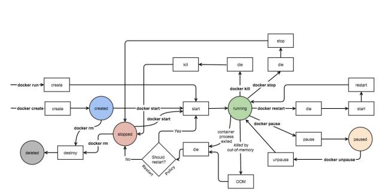

前置知识
`docker run -it imageID cmd`

这个是用镜像产生一个容器，并且和cmd程序做交互

-i表示交互式的，表示[cmd]是一个有用户输入的程序，比如/bin/bash 和 python 等等。

-t 产生一个终端

#### 容器运行

按用途容器大致可分为两类：服务类容器和工具类的容器。

1. **服务类容器以 daemon** 的形式运行，对外提供服务。比如 web server，数据库等。通过 `-d` 以**后台方式启动这类容器**是非常合适的。如果要排查问题，可以通过 `exec -it` 进入容器。

2. **工具类容器**通常给能我们提供一个临时的**工作环境**，通常以 `run -it` 方式运行，比如：基础镜像， busybox、debian、ubuntu 等。

#### stop和kill

`docker stop` 和`docker kill`不一样

`docker stop`先发送**SIGTERM信号**，在一段时间之后（10s）再发送SIGKILL信号。Docker内部的应用程序可以接收SIGTERM信号，然后做一些“退出前工作”，比如保存状态、处理当前请求等。

`docker kill`发送SIGKILL信号，应用程序直接退出

#### start和restart

对于处于停止状态的容器，可以通过 `docker start` 重新启动。
`docker restart` 可以重启容器，其作用就是依次执行 `docker stop` 和`docker start`。
容器可能会因某种错误而停止运行。对于服务类容器，我们通常希望在这种情况下容器能够自动重启。启动容器时设置 `--restart` 就可以达到这个效果。如`docker run -d -- restart=always httpd`

`--restart=always` 意味着无论容器因何种原因退出（包括正常退出），就立即重启。该参数的形式还可以是 `--restart=on-failure:3`，意思是如果启动进程**退出代码非0，则重启容器，最多重启3次。**

#### pause

容器暂停工作一段时间`docker pause `
处于暂停状态的容器不会占用 CPU 资源，直到通过 `docker unpause` 恢复运行。

#### rm

这些容器依然会占用 host 的文件系统资源，如果确认不会再重启此类容器，可以通过 `docker rm` 删除。

`docker rm` 一次可以指定多个容器，如果希望批量删除所有已经退出的容器，可以执行如下命令：

`docker rm -v $(docker ps -aq -f status=exited)`

docker rm删除容器,docker rmi删除镜像

这张图描述了容器相关状态和状态间转换

`docker run`=`docker create`+`docker start` 

如上图
启动进程正常退出或发生 OOM，此时 docker 会根据 `--restart` 的策略判断是否需要重启容器。但如果容器是因为执行 `docker stop` 或`docker kill` 退出，则不会自动重启