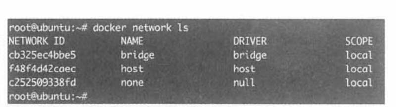
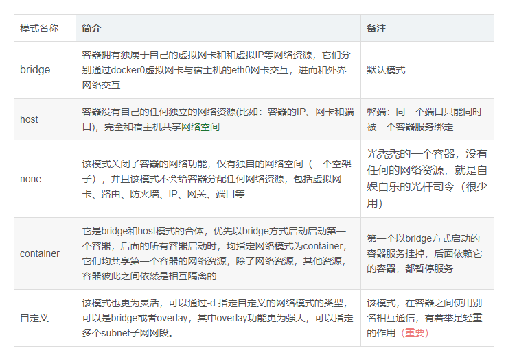

docker network ls 查看host的网络(暂时只讲解单个host上的网络)

#### none网络

如图，none网络除了lo以外没有其他容器，也没有网卡

可以使用`--network=none` 指定使用none网络

`docker run -it --network=none busybox`  把容器运行在none网络上

封闭的none网络，使容器与外网隔离(高安全，不联网)

#### host网络

Docker **host网络性能高**，但**灵活性低**，而且**已经使用的端口不能再被使用**
`--network=host`	指定使用host网络

#### bridge网络

Docker 安装时会创建一个 命名为 `docker0` 的 linux bridge。如果不指定`--network`，创建的容器默认都会挂到 `docker0` 上。

`docker run`  默认模式，最为常用。所以 --stat=bridge 可以省略不写

当前 docker0 上没有任何其他网络设备，我们创建一个容器看看有什么变化。

一个新的**网络接口** `veth28c57df` 被挂到了 `docker0` 上，`veth28c57df`就是**新创建容器的虚拟网卡**。

实际上 `eth0@if34` (容器的网卡)和 `veth28c57df`(veth开头的网络设备,放在主机端) 是一对 **veth pair**。作用是把隔离的网络环境

bridge模式是docker的默认网络模式，不写--net参数，就是bridge模式。使用docker run -p时，docker实际是在iptables做了DNAT规则，实现端口转发功能。

当Docker进程启动时，会在主机上创建一个名为docker0的虚拟网桥(bridge)，此主机上启动的Docker容器会连接到这个虚拟网桥上。虚拟网桥的工作方式和物理交换机类似，这样主机上的**所有容器就通过交换机连在了一个二层网络**中。

当前容器网络拓扑结构如图所示：容

容器创建时，docker 会自动从 172.17.0.0/16 中分配一个 IP，这里 16 位的掩码保证有足够多的 IP 可以供容器使用。

#### 自定义容器user-defined网络

Docker 提供三种 user-defined 网络驱动：bridge, overlay 和 macvlan。overlay 和 macvlan 用于创建跨主机的网络，我们后面有章节单独讨论。

比如`docker network create --driver bridge my_net `**通过bridge驱动创建bridge网络**

查看一下当前 host 的网络结构变化：

只需在创建网段时指定 `--subnet` 和 `--gateway` 参数,就可以自己指定 IP 网段

`docker network create --driver bridge --sub_net 172.18.0.0/16 --gateway 172.18.0.1/16 my_net2`
与前面一样，网关在 `my_net2` 对应的网桥 `br-5d863e9f78b6` 上：

**容器要使用新的网络，需要**在启动时通过 `--network` **指定**：

注：**只有使用 `--subnet` 创建的网络才能指定静态 IP**。

`my_net` 创建时没有指定 `--subnet`，如果指定静态 IP 报错如下：

好了，我们来看看当前 docker host 的网络拓扑结构。

容器之间互相独立,但是通过`veth`虚拟网卡再通过`my_net2`虚拟路由器进行通讯

上面这个表讲的更清楚一点

#### overlay网络模式

overlay网络用于连接不同机器上的docker容器，允许不同机器上的容器相互通信，同时支持对消息进行加密，**实现了跨主机的docker容器之间的通信。**

overlay网络实际上是目前最主流的容器跨节点数据传输和路由方案。底层原理为VXLAN

除了 none, host, bridge 这三个自动创建的网络，用户也可以根据业务需要创建 user-defined 网络，下一节我们将详细讨论