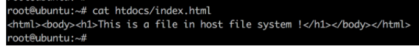

Docker 为容器提供了两种存放数据的资源：

1. 由 storage driver 管理的镜像层和容器层。
2. Data Volume

#### storage driver

容器由**最上面一个可写的容器层**，(image没有写入层)以及若干只读的镜像层组成，容器的数据就存放在这些层中。这样的**分层结构**最大的特性是 **Copy-on-Write**：

1. **新数据会直接存放在最上面**的容器层。
2. 修改现有数据会**先从镜像层将数据复制到容器层**，修**改后的数据直接保存在容器层**中，镜像层保持不变。
3. 如果多个层中有命名相同的文件，用户只能看到最上面那层中的文件。

分层结构使镜像和容器的创建、共享以及分发变得非常高效，而这些都要归功于 Docker storage driver.多种Docker storage driver各有优缺点

不过 Docker 官方会

**优先使用 Linux 发行版默认的 storage driver**。

某些容器需要不保存数据供以后使用(),则将数据保存在当前层中,容器删除时直接删除数据
但如果容器启动时需要加载已有数据,销毁时需要保留数据呢?

#### Data Volume

Data Volume 本质上是 Docker Host 文件系统中的目录或文件，**能够直接被 mount(挂载) 到容器的文件系统中**。

`Volume`就是目录或者文件，它可以绕过默认的联合文件系统，而以正常的文件或者目录的形式存在于宿主机上。

在具体的使用上，docker 提供了两种类型的 volume：bind mount 和 docker managed volume。

Data Volume 有以下特点：

1. **Data Volume 是目录或文件**，而非没有格式化的磁盘（块设备）。
2. 数据卷可以在容器之间共享和重用，**容器间传递数据将变得高效方便**。
3. **volume 数据可以被永久的保存，即使使用它的容器已经销毁**。
4. 数据卷的更新不会影响镜像

因为 volume 实际上是 docker host 文件系统的一部分，所以 volume 的容量取决于文件系统当前未使用的空间，目前还**没有方法设置 volume 的容量**。

#### bind mount

bind mount 是将 host 上已存在的目录或文件 mount(挂载) 到容器

已知docker host 上有目录 $HOME/htdoc

通过 `-v` 将其 mount 到 httpd 容器：

`-v` 的格式为 `<host path>:<container path>`。/usr/local/apache2/htdocs 就是 apache server 存放静态文件的地方。由于 /usr/local/apache2/htdocs 已经存在，原有数据会被隐藏起来，取而代之的是 host $HOME/htdocs/ 中的数据，这与 linux `mount` 命令的行为是一致的。		`<host path> : <container path>`既可以是文件也可以是目录

如下图,加入`:ro参数可以指定为只读`

缺点就是存在本机的host文件系统路径上,会限制其可移植性

#### docker managed volume

docker managed volume的可移植性更好

docker managed volume只需要指明 mount point(目标point) ,不需要指定mount源(被挂载的)。还是以 httpd 容器为例：

我们通过 `-v` 告诉 docker **需要一个 data volume，并将其 mount 到 /usr/local/apache2/htdocs。**
这个 data volume 具体位置可以在容器的配置信息中找到，执行 `docker inspect` 命令：

`docker inspect` 的输出很多，我们感兴趣的是 `Mounts` 这部分，这里会显示容器当前使用的所有 data volume，包括 **bind mount 和 docker managed volume。**

原来，每当容器申请 mount docker manged volume 时，docker 都会在`/var/lib/docker/volumes` 下生成一个目录（例子中是 "/var/lib/docker/volumes/f4a0a1018968f47960efe760829e3c5738c702533d29911b01df9f18babf3340/_data ），**这个目录就是 mount 源,如果 mount point 指向的是已有目录，原有数据会被复制到 volume 中。**

 docker managed volume 的创建过程：

1. 容器启动时，简单的告诉 docker "我需要一个 volume 存放数据，帮我 mount 到目录 /abc"。
2. docker 在 /var/lib/docker/volumes 中生成一个随机目录作为 mount 源。
3. 如果 /abc 已经存在，则将数据复制到 mount 源，
4. 将 volume mount 到 /abc

我们也可以用 `docker volume ls` 

**docker volume只能查看 docker managed volume，还看不到 bind mount**；同时**也无法知道 volume 对应的容器**，这些信息还得靠docker inspect

|                        | bind mount                   | docker managed volume        |
| :--------------------- | :--------------------------- | ---------------------------- |
| volume 位置            | 可任意指定                   | /var/lib/docker/volumes/...  |
| 对已有mount point 影响 | 隐藏并替换为 volume          | 原有数据复制到 volume        |
| 是否支持单个文件       | 支持                         | 不支持，只能是目录           |
| 权限控制               | 可设置为只读，默认为读写权限 | 无控制，均为读写权限         |
| 移植性                 | 移植性弱，与 host path 绑定  | 移植性强，无需指定 host 目录 |

下节讨论如何通过 data volume 实现容器与 host，容器与容器共享数据。